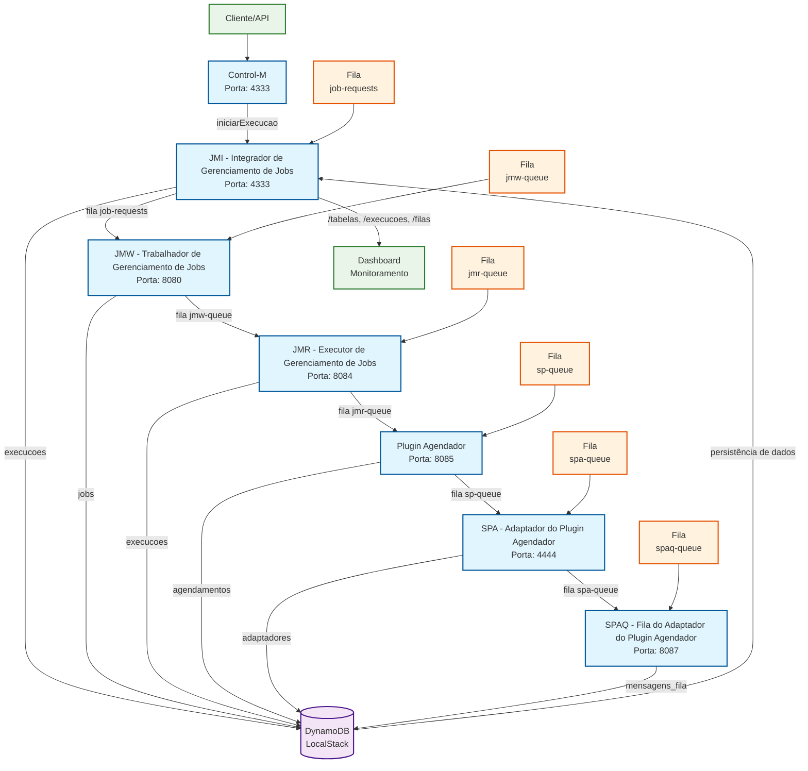

# POC BDD - Diagrama de Fluxo de Dados

## Visão Geral do Fluxo de Dados



## Detalhamento dos Dados por Serviço

### 1. **Control-M** (Entrada do Sistema)
- **Entrada**: Requisições HTTP com `nomeExecucao`
- **Saída**: UUID de execução e status
- **Dados**: Metadados de execução inicial

### 2. **JMI - Integrador de Gerenciamento de Jobs** (Orquestrador)
- **Entrada**: Comandos de execução via HTTP
- **Processamento**: Aplica latência configurável (0-10s)
- **Saída**: 
  - Dados versionados para DynamoDB (tabela `execucoes`)
  - Mensagens para fila `job-requests`
- **Dados Persistidos**:
  ```json
  {
    "nomeExecucao": "TESTE_123#v1#jmi-inicio",
    "nomeOriginal": "TESTE_123",
    "uuidExecucao": "uuid-123",
    "status": "iniciado",
    "estagio": "jmi-inicio",
    "processadoPor": "JMI",
    "versao": 1,
    "timestamp": 1749840000,
    "criadoEm": "2025-06-13T15:00:00Z",
    "atualizadoEm": "2025-06-13T15:00:00Z"
  }
  ```

### 3. **JMW - Trabalhador de Gerenciamento de Jobs** (Processador de Jobs)
- **Entrada**: Mensagens da fila `job-requests`
- **Processamento**: Processa jobs e aplica transformações
- **Saída**: 
  - Dados para tabela `jobs`
  - Mensagens para fila `jmw-queue`
- **Dados**: Informações de jobs processados

### 4. **JMR - Executor de Gerenciamento de Jobs** (Executor)
- **Entrada**: Mensagens da fila `jmw-queue`
- **Processamento**: Executa jobs e atualiza status
- **Saída**: 
  - Atualizações na tabela `execucoes`
  - Mensagens para fila `jmr-queue`
- **Dados**: Status de execução e resultados

### 5. **Plugin Agendador** (Agendador)
- **Entrada**: Mensagens da fila `jmr-queue`
- **Processamento**: Cria e gerencia agendamentos
- **Saída**: 
  - Dados para tabela `agendamentos`
  - Mensagens para fila `sp-queue`
- **Dados**: Configurações de agendamento e cronogramas

### 6. **SPA - Adaptador do Plugin Agendador** (Adaptador)
- **Entrada**: Mensagens da fila `sp-queue`
- **Processamento**: Adapta formatos e protocolos
- **Saída**: 
  - Dados para tabela `adaptadores`
  - Mensagens para fila `spa-queue`
- **Dados**: Configurações de adaptadores

### 7. **SPAQ - Fila do Adaptador do Plugin Agendador** (Gerenciador de Filas)
- **Entrada**: Mensagens da fila `spa-queue`
- **Processamento**: Gerencia filas e mensagens
- **Saída**: Dados para tabela `mensagens_fila`
- **Dados**: Estatísticas e logs de mensagens

## Tabelas DynamoDB

| Tabela | Responsável | Tipo de Dados |
|--------|-------------|---------------|
| `execucoes` | JMI, JMR | Execuções versionadas com metadados |
| `jobs` | JMW | Definições e status de jobs |
| `agendamentos` | Plugin Agendador | Configurações de agendamento |
| `adaptadores` | SPA | Configurações de adaptadores |
| `mensagens_fila` | SPAQ | Logs e estatísticas de mensagens |

## Filas SQS

| Fila | Origem | Destino | Tipo de Mensagem |
|------|--------|---------|------------------|
| `job-requests` | JMI | JMW | Solicitações de processamento |
| `jmw-queue` | JMW | JMR | Jobs processados |
| `jmr-queue` | JMR | Plugin Agendador | Execuções completadas |
| `sp-queue` | Plugin Agendador | SPA | Agendamentos criados |
| `spa-queue` | SPA | SPAQ | Adaptações configuradas |
| `spaq-queue` | SPAQ | - | Mensagens finalizadas |

## Características do Fluxo de Dados

### ✅ **Versionamento**
- Cada execução recebe uma chave única: `{nome}#v{versao}#{estagio}`
- Rastreabilidade completa do ciclo de vida

### ✅ **Latência Configurável**
- Delay artificial aplicado em cada serviço (0-10000ms)
- Simulação de processamento real

### ✅ **Persistência Garantida**
- Dados armazenados em DynamoDB via AWS SDK v2
- Configuração corrigida com `SigningRegion: "us-east-1"`

### ✅ **Monitoramento Integrado**
- Endpoints de monitoramento no JMI
- Dashboard em tempo real
- Visibilidade completa do fluxo

## Padrões de Dados

### **Entrada Típica**
```json
{
  "nomeExecucao": "JOB_PRODUCAO_001"
}
```

### **Saída Versionada**
```json
{
  "nomeExecucao": "JOB_PRODUCAO_001#v1#jmi-inicio",
  "nomeOriginal": "JOB_PRODUCAO_001",
  "uuidExecucao": "550e8400-e29b-41d4-a716-446655440000",
  "status": "iniciado",
  "estagio": "jmi-inicio",
  "processadoPor": "JMI",
  "versao": 1,
  "timestamp": 1749840000,
  "criadoEm": "2025-06-13T15:00:00Z",
  "atualizadoEm": "2025-06-13T15:00:00Z"
}
```

---

**Nota**: Este diagrama representa o fluxo de dados após as correções implementadas, com integração completa entre microsserviços e LocalStack funcionando via AWS SDK v2.
