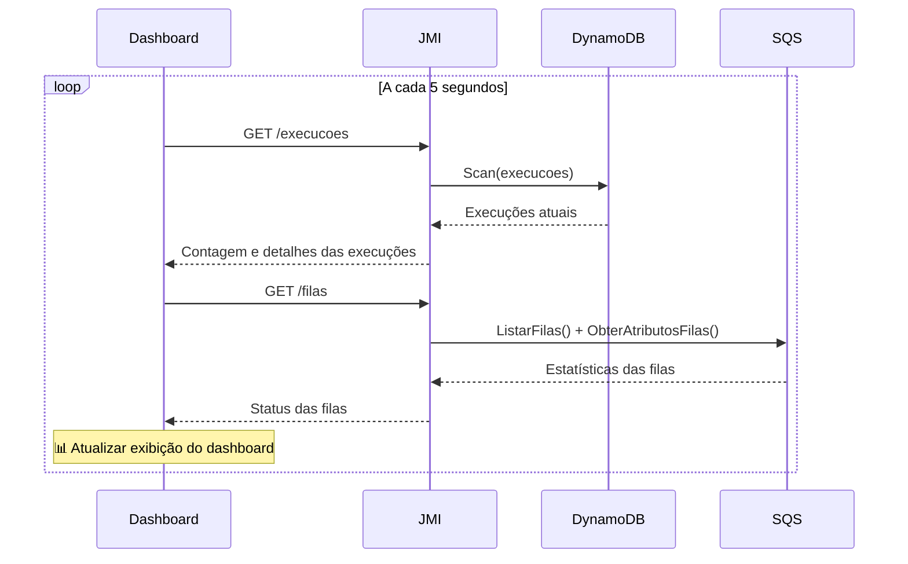
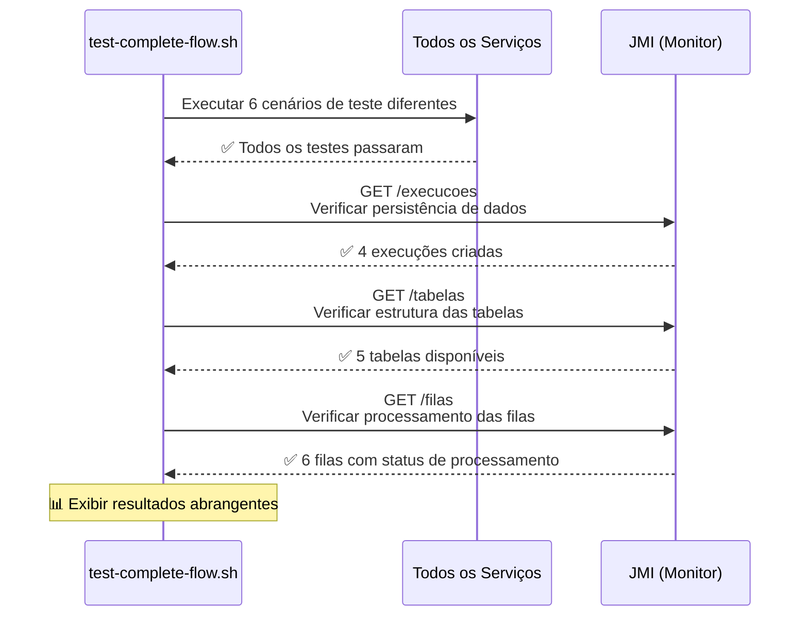
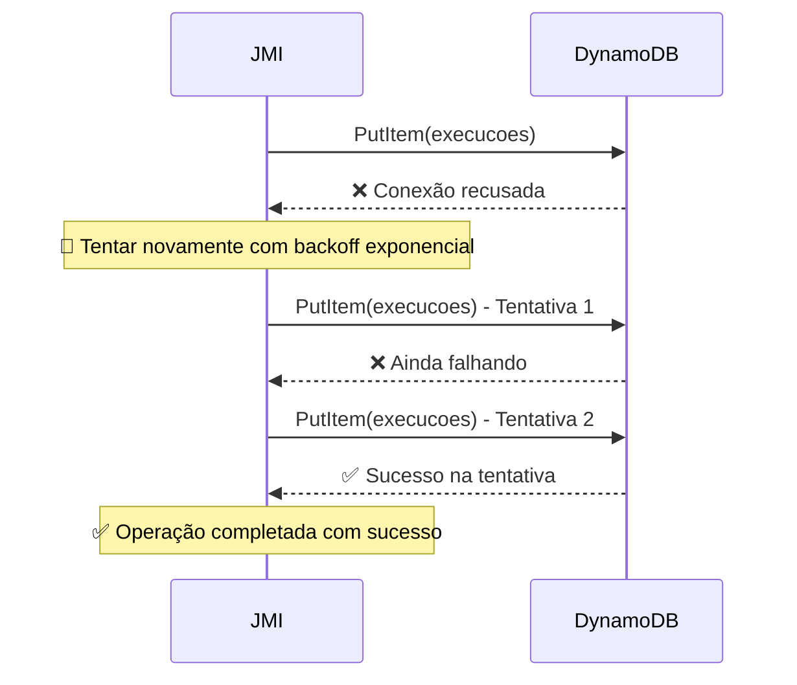

# POC BDD - Diagrama de Sequência

## Fluxo Completo de Execução

```mermaid
sequenceDiagram
    participant Cliente as Cliente
    participant CM as Control-M<br/>(4333)
    participant JMI as JMI<br/>(4333)
    participant DDB as DynamoDB<br/>(LocalStack)
    participant SQS as Filas SQS<br/>(LocalStack)
    participant JMW as JMW<br/>(8080)
    participant JMR as JMR<br/>(8084)
    participant SP as Plugin Agendador<br/>(8085)
    participant SPA as SPA<br/>(4444)
    participant SPAQ as SPAQ<br/>(8087)
    participant MON as Dashboard<br/>(Monitoramento)

    %% Início da Execução
    Note over Cliente,SPAQ: 🚀 Início do Fluxo de Execução
    
    Cliente->>CM: POST /iniciarExecucao<br/>{"nomeExecucao": "TESTE_123"}
    CM->>JMI: Encaminhar solicitação iniciarExecucao
    
    %% Processamento JMI
    Note over JMI: ⏱️ Aplicar latência configurável (0-10s)
    JMI->>JMI: Gerar UUID e chave versionada<br/>"TESTE_123#v1#jmi-inicio"
    
    %% Persistência de Dados
    JMI->>DDB: PutItem(execucoes)<br/>Dados de execução versionados
    DDB-->>JMI: ✅ Sucesso
    
    %% Mensagem na Fila
    JMI->>SQS: EnviarMensagem(job-requests)<br/>Solicitação de processamento de job
    SQS-->>JMI: ✅ Mensagem enviada
    
    JMI-->>CM: ✅ {"uuidExecucao": "uuid-123", "status": "iniciado"}
    CM-->>Cliente: ✅ Execução iniciada com sucesso
    
    %% Processamento JMW
    Note over JMW: 📨 Consultando fila job-requests
    SQS->>JMW: ReceberMensagem(job-requests)
    JMW->>JMW: Processar dados do job<br/>Aplicar transformações
    
    JMW->>DDB: PutItem(jobs)<br/>Dados de processamento do job
    DDB-->>JMW: ✅ Sucesso
    
    JMW->>SQS: EnviarMensagem(jmw-queue)<br/>Job processado
    SQS-->>JMW: ✅ Mensagem enviada
    
    JMW->>SQS: DeletarMensagem(job-requests)<br/>Remover mensagem processada
    
    %% Processamento JMR
    Note over JMR: 🏃 Consultando fila jmw-queue
    SQS->>JMR: ReceberMensagem(jmw-queue)
    JMR->>JMR: Executar job<br/>Atualizar status da execução
    
    JMR->>DDB: AtualizarItem(execucoes)<br/>Resultados da execução
    DDB-->>JMR: ✅ Sucesso
    
    JMR->>SQS: EnviarMensagem(jmr-queue)<br/>Execução completada
    SQS-->>JMR: ✅ Mensagem enviada
    
    
    %% Processamento Plugin Agendador
    Note over SP: 📅 Consultando fila jmr-queue
    SQS->>SP: ReceberMensagem(jmr-queue)
    SP->>SP: Criar agendamento<br/>Gerar expressões cron
    
    SP->>DDB: PutItem(agendamentos)<br/>Configuração de agendamento
    DDB-->>SP: ✅ Sucesso
    
    SP->>SQS: EnviarMensagem(sp-queue)<br/>Agendamento criado
    SQS-->>SP: ✅ Mensagem enviada
    
    SP->>SQS: DeletarMensagem(jmr-queue)<br/>Remover mensagem processada
    
    %% Processamento SPA
    Note over SPA: 🔌 Consultando fila sp-queue
    SQS->>SPA: ReceberMensagem(sp-queue)
    SPA->>SPA: Configurar adaptador<br/>Configurar integrações
    
    SPA->>DDB: PutItem(adaptadores)<br/>Configuração do adaptador
    DDB-->>SPA: ✅ Sucesso
    
    SPA->>SQS: EnviarMensagem(spa-queue)<br/>Adaptador configurado
    SQS-->>SPA: ✅ Mensagem enviada
    
    SPA->>SQS: DeletarMensagem(sp-queue)<br/>Remover mensagem processada
    
    %% Processamento SPAQ
    Note over SPAQ: 📊 Consultando fila spa-queue
    SQS->>SPAQ: ReceberMensagem(spa-queue)
    SPAQ->>SPAQ: Processar mensagem da fila<br/>Gerar estatísticas
    
    SPAQ->>DDB: PutItem(mensagens_fila)<br/>Estatísticas da mensagem
    DDB-->>SPAQ: ✅ Sucesso
    
    SPAQ->>SQS: DeletarMensagem(spa-queue)<br/>Remover mensagem processada
    
    %% Monitoramento e Dashboard
    Note over MON: 📊 Monitoramento em Tempo Real
    MON->>JMI: GET /execucoes<br/>Listar todas as execuções
    JMI->>DDB: Scan(execucoes)
    DDB-->>JMI: Dados das execuções
    JMI-->>MON: ✅ Lista de execuções
    
    MON->>JMI: GET /tabelas<br/>Listar tabelas DynamoDB
    JMI->>DDB: ListarTabelas()
    DDB-->>JMI: Nomes das tabelas
    JMI-->>MON: ✅ Lista de tabelas
    
    MON->>JMI: GET /filas<br/>Status das filas SQS
    JMI->>SQS: ListarFilas() + ObterAtributosFilas()
    SQS-->>JMI: Estatísticas das filas
    JMI-->>MON: ✅ Status das filas
    
## Cenários de Uso Detalhados

### 1. **Cenário: Execução Simples**

```mermaid
sequenceDiagram
    participant Cliente as Cliente
    participant JMI as JMI
    participant DDB as DynamoDB
    
    Cliente->>JMI: POST /iniciarExecucao<br/>{"nomeExecucao": "JOB_SIMPLES"}
    
    Note over JMI: ⏱️ Delay: 3000ms (configurável)
    
    JMI->>JMI: Criar chave versionada:<br/>"JOB_SIMPLES#v1#jmi-inicio"
    
    JMI->>DDB: PutItem(execucoes)<br/>{<br/>  "nomeExecucao": "JOB_SIMPLES#v1#jmi-inicio",<br/>  "nomeOriginal": "JOB_SIMPLES",<br/>  "status": "iniciado",<br/>  "estagio": "jmi-inicio",<br/>  "processadoPor": "JMI"<br/>}
    
    DDB-->>JMI: ✅ Item armazenado com sucesso
    
    JMI-->>Cliente: ✅ {<br/>  "uuidExecucao": "uuid-456",<br/>  "mensagem": "Execução iniciada com sucesso"<br/>}
```

### 2. **Cenário: Monitoramento em Tempo Real**



### 3. **Cenário: Teste Completo de Fluxo**



## Tempos e Performance

### **Latência Configurável**
- **Padrão**: 10000ms (10 segundos)
- **Configurável**: 0ms a 10000ms via `./definir-latencia.sh`
- **Aplicação**: Cada serviço aplica delay antes do processamento

### **Tempos Típicos de Resposta**
| Operação | Tempo Esperado | Observações |
|----------|----------------|-------------|
| iniciarExecucao | 10-15s | Inclui latência + persistência |
| Verificação de Saúde | <100ms | Resposta imediata |
| Atualização Dashboard | 1-2s | Múltiplas consultas |
| Processamento de Fila | 5-20s | Depende do polling |

### **Throughput**
- **Execuções simultâneas**: Suportado via filas SQS
- **Persistência**: Garantida via AWS SDK v2
- **Monitoramento**: Tempo real via endpoints

## Estados e Transições

### **Estados de Execução**
1. **iniciado** → JMI cria execução inicial
2. **processando** → JMW/JMR processam job
3. **agendado** → Plugin Agendador cria agendamento
4. **adaptado** → SPA configura adaptadores
5. **completado** → SPAQ finaliza processamento

### **Estados de Fila**
- **mensagensVisiveis**: Mensagens aguardando processamento
- **mensagensNaoVisiveis**: Mensagens sendo processadas
- **vazia**: Fila sem mensagens pendentes

## Tratamento de Erros

### **Cenário: Falha de Conectividade**


---

**Nota**: Este diagrama representa o fluxo após todas as correções implementadas, com AWS SDK v2 funcionando corretamente e endpoints de monitoramento integrados.
