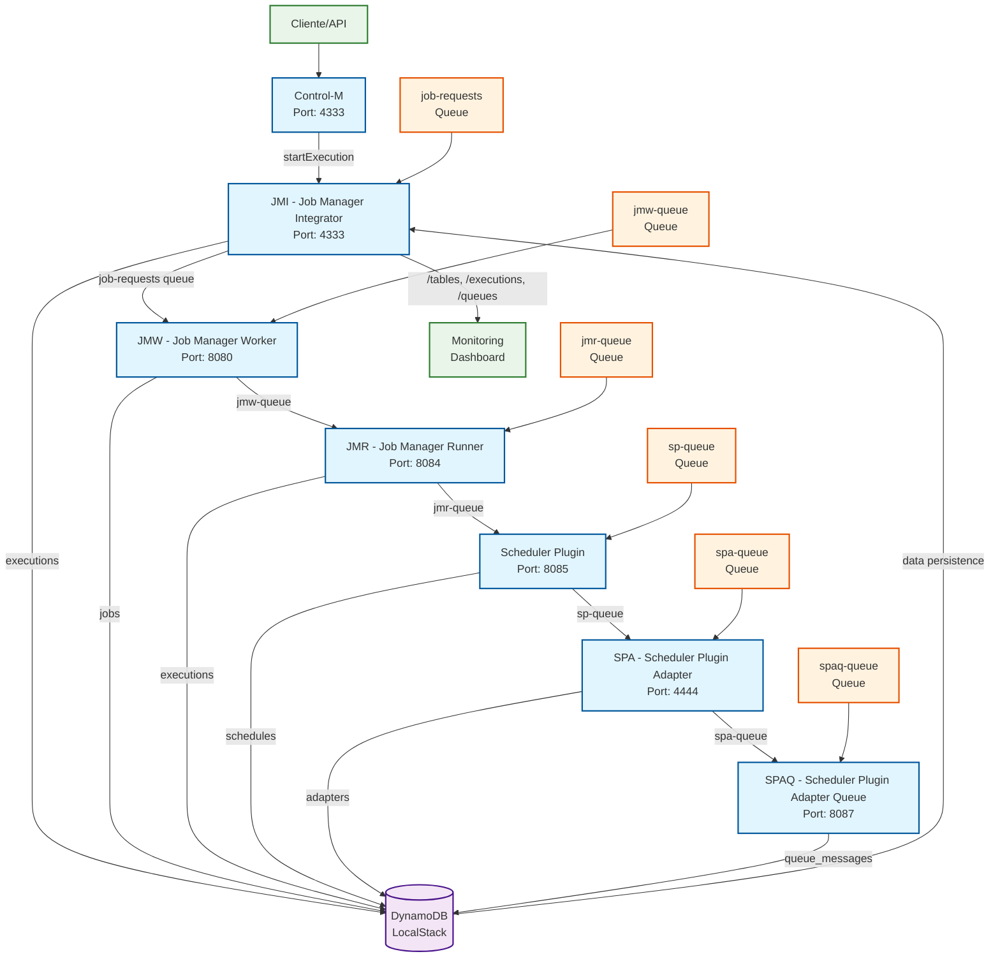

# POC BDD - Diagrama de Data Flow

## Visão Geral do Fluxo de Dados



## Detalhamento dos Dados por Serviço

### 1. **Control-M** (Entrada do Sistema)
- **Input**: Requisições HTTP com `executionName`
- **Output**: UUID de execução e status
- **Dados**: Metadados de execução inicial

### 2. **JMI - Job Manager Integrator** (Orquestrador)
- **Input**: Comandos de execução via HTTP
- **Processing**: Aplica latência configurável (0-10s)
- **Output**: 
  - Dados versionados para DynamoDB (`executions` table)
  - Mensagens para fila `job-requests`
- **Dados Persistidos**:
  ```json
  {
    "executionName": "TEST_123#v1#jmi-start",
    "originalName": "TEST_123",
    "executionUuid": "uuid-123",
    "status": "started",
    "stage": "jmi-start",
    "processedBy": "JMI",
    "version": 1,
    "timestamp": 1749840000,
    "createdAt": "2025-06-13T15:00:00Z",
    "updatedAt": "2025-06-13T15:00:00Z"
  }
  ```

### 3. **JMW - Job Manager Worker** (Processador de Jobs)
- **Input**: Mensagens da fila `job-requests`
- **Processing**: Processa jobs e aplica transformações
- **Output**: 
  - Dados para tabela `jobs`
  - Mensagens para fila `jmw-queue`
- **Dados**: Informações de jobs processados

### 4. **JMR - Job Manager Runner** (Executor)
- **Input**: Mensagens da fila `jmw-queue`
- **Processing**: Executa jobs e atualiza status
- **Output**: 
  - Atualizações na tabela `executions`
  - Mensagens para fila `jmr-queue`
- **Dados**: Status de execução e resultados

### 5. **Scheduler Plugin** (Agendador)
- **Input**: Mensagens da fila `jmr-queue`
- **Processing**: Cria e gerencia agendamentos
- **Output**: 
  - Dados para tabela `schedules`
  - Mensagens para fila `sp-queue`
- **Dados**: Configurações de agendamento e cronogramas

### 6. **SPA - Scheduler Plugin Adapter** (Adaptador)
- **Input**: Mensagens da fila `sp-queue`
- **Processing**: Adapta formatos e protocolos
- **Output**: 
  - Dados para tabela `adapters`
  - Mensagens para fila `spa-queue`
- **Dados**: Configurações de adaptadores

### 7. **SPAQ - Scheduler Plugin Adapter Queue** (Gerenciador de Filas)
- **Input**: Mensagens da fila `spa-queue`
- **Processing**: Gerencia filas e mensagens
- **Output**: Dados para tabela `queue_messages`
- **Dados**: Estatísticas e logs de mensagens

## Tabelas DynamoDB

| Tabela | Responsável | Tipo de Dados |
|--------|-------------|---------------|
| `executions` | JMI, JMR | Execuções versionadas com metadados |
| `jobs` | JMW | Definições e status de jobs |
| `schedules` | Scheduler Plugin | Configurações de agendamento |
| `adapters` | SPA | Configurações de adaptadores |
| `queue_messages` | SPAQ | Logs e estatísticas de mensagens |

## Filas SQS

| Fila | Origem | Destino | Tipo de Mensagem |
|------|--------|---------|------------------|
| `job-requests` | JMI | JMW | Solicitações de processamento |
| `jmw-queue` | JMW | JMR | Jobs processados |
| `jmr-queue` | JMR | Scheduler Plugin | Execuções completadas |
| `sp-queue` | Scheduler Plugin | SPA | Agendamentos criados |
| `spa-queue` | SPA | SPAQ | Adaptações configuradas |
| `spaq-queue` | SPAQ | - | Mensagens finalizadas |

## Características do Fluxo de Dados

### ✅ **Versionamento**
- Cada execução recebe uma chave única: `{nome}#v{versão}#{estágio}`
- Rastreabilidade completa do ciclo de vida

### ✅ **Latência Configurável**
- Delay artificial aplicado em cada serviço (0-10000ms)
- Simulação de processamento real

### ✅ **Persistência Garantida**
- Dados armazenados em DynamoDB via AWS SDK v2
- Configuração corrigida com `SigningRegion: "us-east-1"`

### ✅ **Monitoramento Integrado**
- Endpoints de monitoramento no JMI
- Dashboard em tempo real
- Visibilidade completa do fluxo

## Padrões de Dados

### **Entrada Típica**
```json
{
  "executionName": "PRODUCTION_JOB_001"
}
```

### **Saída Versionada**
```json
{
  "executionName": "PRODUCTION_JOB_001#v1#jmi-start",
  "originalName": "PRODUCTION_JOB_001",
  "executionUuid": "550e8400-e29b-41d4-a716-446655440000",
  "status": "started",
  "stage": "jmi-start",
  "processedBy": "JMI",
  "version": 1,
  "timestamp": 1749840000,
  "createdAt": "2025-06-13T15:00:00Z",
  "updatedAt": "2025-06-13T15:00:00Z"
}
```

---

**Nota**: Este diagrama representa o fluxo de dados após as correções implementadas, com integração completa entre microserviços e LocalStack funcionando via AWS SDK v2.
