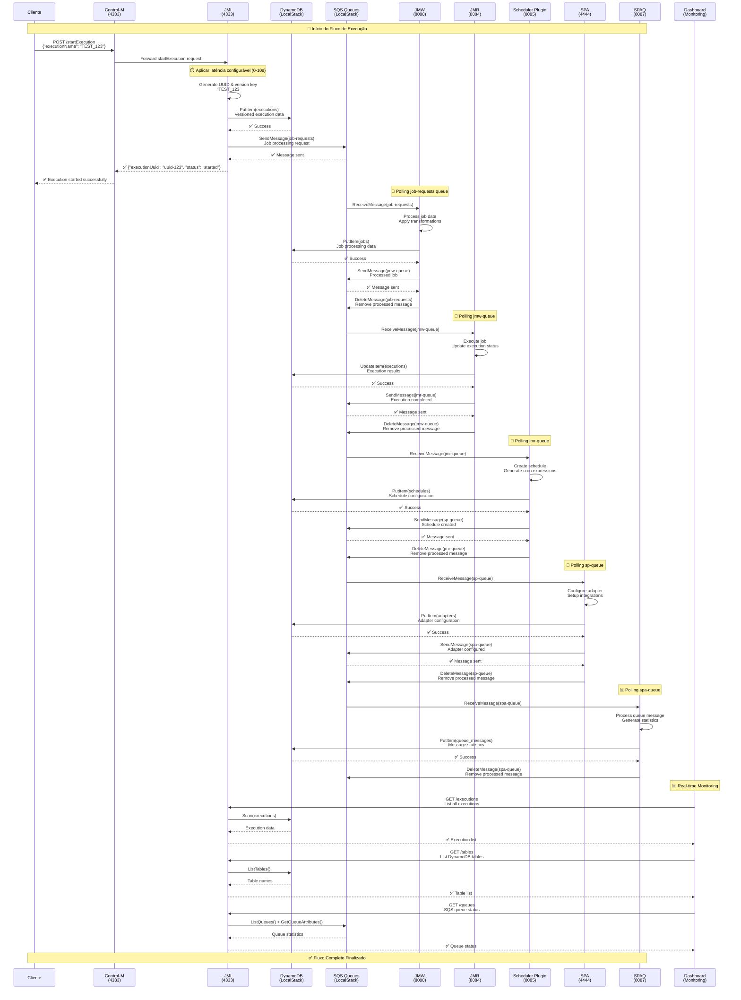
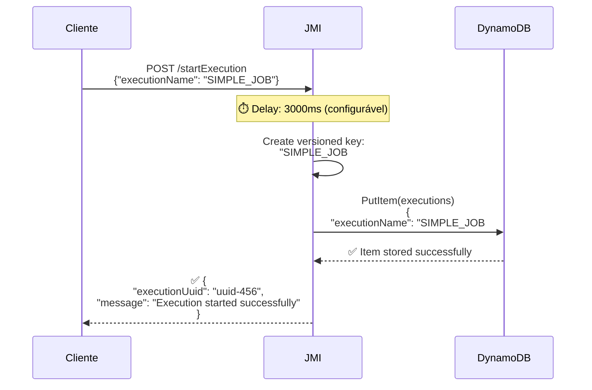
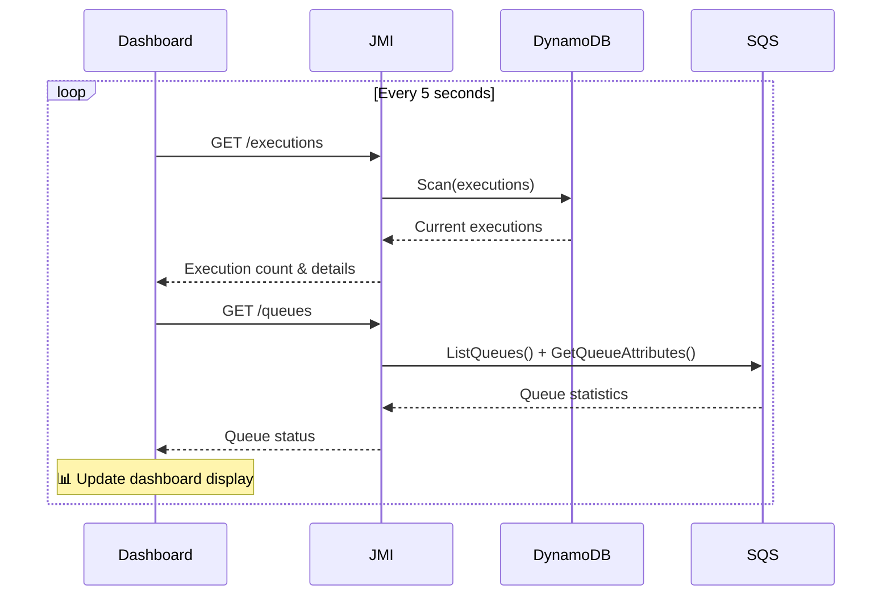
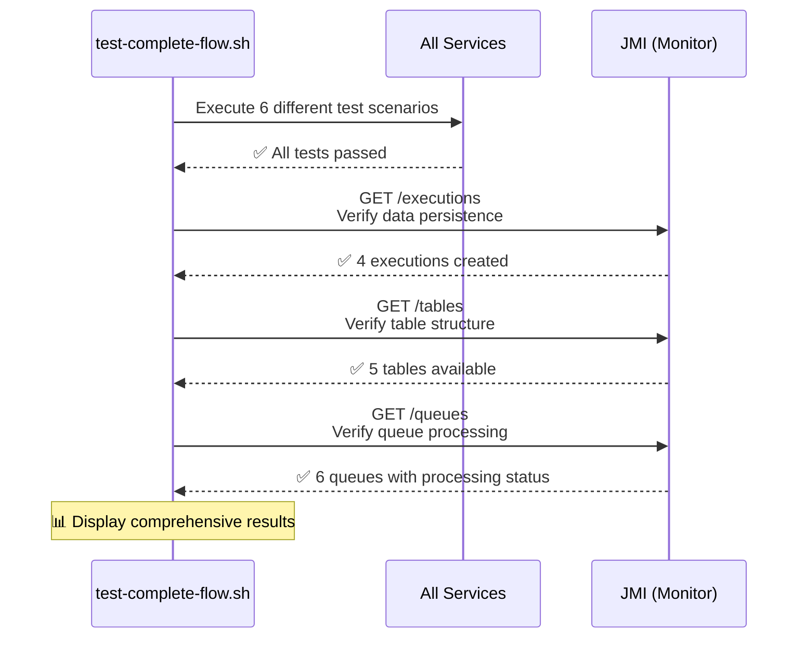
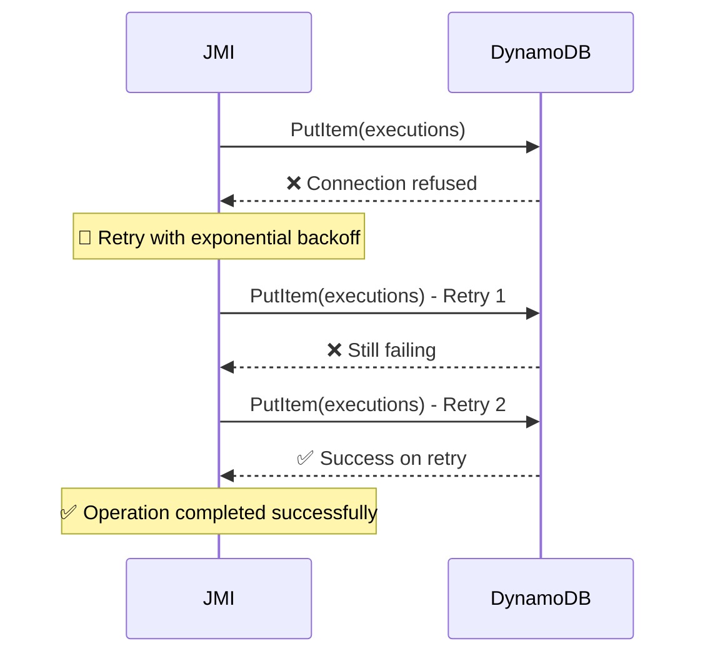

# POC BDD - Diagrama de Sequência

## Fluxo Completo de Execução

## Cenários de Uso Detalhados

### 1. **Cenário: Execução Simples**

### 2. **Cenário: Monitoramento em Tempo Real**

### 3. **Cenário: Teste Completo de Fluxo**

## Timing e Performance

### **Latência Configurável**
- **Padrão**: 10000ms (10 segundos)
- **Configurável**: 0ms a 10000ms via `./set-latency.sh`
- **Aplicação**: Cada serviço aplica delay antes do processamento

### **Tempos Típicos de Resposta**
| Operação | Tempo Esperado | Observações |
|----------|----------------|-------------|
| startExecution | 10-15s | Inclui latência + persistência |
| Health Check | <100ms | Resposta imediata |
| Dashboard Update | 1-2s | Múltiplas consultas |
| Queue Processing | 5-20s | Depende do polling |

### **Throughput**
- **Execuções simultâneas**: Suportado via filas SQS
- **Persistência**: Garantida via AWS SDK v2
- **Monitoramento**: Tempo real via endpoints

## Estados e Transições

### **Estados de Execução**
1. **started** → JMI cria execução inicial
2. **processing** → JMW/JMR processam job
3. **scheduled** → Scheduler Plugin cria agendamento
4. **adapted** → SPA configura adaptadores
5. **completed** → SPAQ finaliza processamento

### **Estados de Fila**
- **visibleMessages**: Mensagens aguardando processamento
- **notVisibleMessages**: Mensagens sendo processadas
- **empty**: Fila sem mensagens pendentes

## Tratamento de Erros

### **Cenário: Falha de Conectividade**

---

**Nota**: Este diagrama representa o fluxo após todas as correções implementadas, com AWS SDK v2 funcionando corretamente e endpoints de monitoramento integrados.
