# POC BDD - Diagrama de Sequência

## Fluxo Completo de Execução

```mermaid
sequenceDiagram
    participant Client as Cliente
    participant CM as Control-M<br/>(4333)
    participant JMI as JMI<br/>(4333)
    participant DDB as DynamoDB<br/>(LocalStack)
    participant SQS as SQS Queues<br/>(LocalStack)
    participant JMW as JMW<br/>(8080)
    participant JMR as JMR<br/>(8084)
    participant SP as Scheduler Plugin<br/>(8085)
    participant SPA as SPA<br/>(4444)
    participant SPAQ as SPAQ<br/>(8087)
    participant MON as Dashboard<br/>(Monitoring)

    %% Início da Execução
    Note over Client,SPAQ: 🚀 Início do Fluxo de Execução
    
    Client->>CM: POST /startExecution<br/>{"executionName": "TEST_123"}
    CM->>JMI: Forward startExecution request
    
    %% JMI Processing
    Note over JMI: ⏱️ Aplicar latência configurável (0-10s)
    JMI->>JMI: Generate UUID & version key<br/>"TEST_123#v1#jmi-start"
    
    %% Data Persistence
    JMI->>DDB: PutItem(executions)<br/>Versioned execution data
    DDB-->>JMI: ✅ Success
    
    %% Queue Message
    JMI->>SQS: SendMessage(job-requests)<br/>Job processing request
    SQS-->>JMI: ✅ Message sent
    
    JMI-->>CM: ✅ {"executionUuid": "uuid-123", "status": "started"}
    CM-->>Client: ✅ Execution started successfully
    
    %% JMW Processing
    Note over JMW: 📨 Polling job-requests queue
    SQS->>JMW: ReceiveMessage(job-requests)
    JMW->>JMW: Process job data<br/>Apply transformations
    
    JMW->>DDB: PutItem(jobs)<br/>Job processing data
    DDB-->>JMW: ✅ Success
    
    JMW->>SQS: SendMessage(jmw-queue)<br/>Processed job
    SQS-->>JMW: ✅ Message sent
    
    JMW->>SQS: DeleteMessage(job-requests)<br/>Remove processed message
    
    %% JMR Processing
    Note over JMR: 🏃 Polling jmw-queue
    SQS->>JMR: ReceiveMessage(jmw-queue)
    JMR->>JMR: Execute job<br/>Update execution status
    
    JMR->>DDB: UpdateItem(executions)<br/>Execution results
    DDB-->>JMR: ✅ Success
    
    JMR->>SQS: SendMessage(jmr-queue)<br/>Execution completed
    SQS-->>JMR: ✅ Message sent
    
    JMR->>SQS: DeleteMessage(jmw-queue)<br/>Remove processed message
    
    %% Scheduler Plugin Processing
    Note over SP: 📅 Polling jmr-queue
    SQS->>SP: ReceiveMessage(jmr-queue)
    SP->>SP: Create schedule<br/>Generate cron expressions
    
    SP->>DDB: PutItem(schedules)<br/>Schedule configuration
    DDB-->>SP: ✅ Success
    
    SP->>SQS: SendMessage(sp-queue)<br/>Schedule created
    SQS-->>SP: ✅ Message sent
    
    SP->>SQS: DeleteMessage(jmr-queue)<br/>Remove processed message
    
    %% SPA Processing
    Note over SPA: 🔌 Polling sp-queue
    SQS->>SPA: ReceiveMessage(sp-queue)
    SPA->>SPA: Configure adapter<br/>Setup integrations
    
    SPA->>DDB: PutItem(adapters)<br/>Adapter configuration
    DDB-->>SPA: ✅ Success
    
    SPA->>SQS: SendMessage(spa-queue)<br/>Adapter configured
    SQS-->>SPA: ✅ Message sent
    
    SPA->>SQS: DeleteMessage(sp-queue)<br/>Remove processed message
    
    %% SPAQ Processing
    Note over SPAQ: 📊 Polling spa-queue
    SQS->>SPAQ: ReceiveMessage(spa-queue)
    SPAQ->>SPAQ: Process queue message<br/>Generate statistics
    
    SPAQ->>DDB: PutItem(queue_messages)<br/>Message statistics
    DDB-->>SPAQ: ✅ Success
    
    SPAQ->>SQS: DeleteMessage(spa-queue)<br/>Remove processed message
    
    %% Monitoring & Dashboard
    Note over MON: 📊 Real-time Monitoring
    MON->>JMI: GET /executions<br/>List all executions
    JMI->>DDB: Scan(executions)
    DDB-->>JMI: Execution data
    JMI-->>MON: ✅ Execution list
    
    MON->>JMI: GET /tables<br/>List DynamoDB tables
    JMI->>DDB: ListTables()
    DDB-->>JMI: Table names
    JMI-->>MON: ✅ Table list
    
    MON->>JMI: GET /queues<br/>SQS queue status
    JMI->>SQS: ListQueues() + GetQueueAttributes()
    SQS-->>JMI: Queue statistics
    JMI-->>MON: ✅ Queue status
    
    %% Final Status
    Note over Client,SPAQ: ✅ Fluxo Completo Finalizado
```

## Cenários de Uso Detalhados

### 1. **Cenário: Execução Simples**

```mermaid
sequenceDiagram
    participant Client as Cliente
    participant JMI as JMI
    participant DDB as DynamoDB
    
    Client->>JMI: POST /startExecution<br/>{"executionName": "SIMPLE_JOB"}
    
    Note over JMI: ⏱️ Delay: 3000ms (configurável)
    
    JMI->>JMI: Create versioned key:<br/>"SIMPLE_JOB#v1#jmi-start"
    
    JMI->>DDB: PutItem(executions)<br/>{<br/>  "executionName": "SIMPLE_JOB#v1#jmi-start",<br/>  "originalName": "SIMPLE_JOB",<br/>  "status": "started",<br/>  "stage": "jmi-start",<br/>  "processedBy": "JMI"<br/>}
    
    DDB-->>JMI: ✅ Item stored successfully
    
    JMI-->>Client: ✅ {<br/>  "executionUuid": "uuid-456",<br/>  "message": "Execution started successfully"<br/>}
```

### 2. **Cenário: Monitoramento em Tempo Real**

```mermaid
sequenceDiagram
    participant Dashboard as Dashboard
    participant JMI as JMI
    participant DDB as DynamoDB
    participant SQS as SQS
    
    loop Every 5 seconds
        Dashboard->>JMI: GET /executions
        JMI->>DDB: Scan(executions)
        DDB-->>JMI: Current executions
        JMI-->>Dashboard: Execution count & details
        
        Dashboard->>JMI: GET /queues
        JMI->>SQS: ListQueues() + GetQueueAttributes()
        SQS-->>JMI: Queue statistics
        JMI-->>Dashboard: Queue status
        
        Note over Dashboard: 📊 Update dashboard display
    end
```

### 3. **Cenário: Teste Completo de Fluxo**

```mermaid
sequenceDiagram
    participant Script as test-complete-flow.sh
    participant Services as All Services
    participant JMI as JMI (Monitor)
    
    Script->>Services: Execute 6 different test scenarios
    Services-->>Script: ✅ All tests passed
    
    Script->>JMI: GET /executions<br/>Verify data persistence
    JMI-->>Script: ✅ 4 executions created
    
    Script->>JMI: GET /tables<br/>Verify table structure
    JMI-->>Script: ✅ 5 tables available
    
    Script->>JMI: GET /queues<br/>Verify queue processing
    JMI-->>Script: ✅ 6 queues with processing status
    
    Note over Script: 📊 Display comprehensive results
```

## Timing e Performance

### **Latência Configurável**
- **Padrão**: 10000ms (10 segundos)
- **Configurável**: 0ms a 10000ms via `./set-latency.sh`
- **Aplicação**: Cada serviço aplica delay antes do processamento

### **Tempos Típicos de Resposta**
| Operação | Tempo Esperado | Observações |
|----------|----------------|-------------|
| startExecution | 10-15s | Inclui latência + persistência |
| Health Check | <100ms | Resposta imediata |
| Dashboard Update | 1-2s | Múltiplas consultas |
| Queue Processing | 5-20s | Depende do polling |

### **Throughput**
- **Execuções simultâneas**: Suportado via filas SQS
- **Persistência**: Garantida via AWS SDK v2
- **Monitoramento**: Tempo real via endpoints

## Estados e Transições

### **Estados de Execução**
1. **started** → JMI cria execução inicial
2. **processing** → JMW/JMR processam job
3. **scheduled** → Scheduler Plugin cria agendamento
4. **adapted** → SPA configura adaptadores
5. **completed** → SPAQ finaliza processamento

### **Estados de Fila**
- **visibleMessages**: Mensagens aguardando processamento
- **notVisibleMessages**: Mensagens sendo processadas
- **empty**: Fila sem mensagens pendentes

## Tratamento de Erros

### **Cenário: Falha de Conectividade**

```mermaid
sequenceDiagram
    participant JMI as JMI
    participant DDB as DynamoDB
    
    JMI->>DDB: PutItem(executions)
    DDB-->>JMI: ❌ Connection refused
    
    Note over JMI: 🔄 Retry with exponential backoff
    
    JMI->>DDB: PutItem(executions) - Retry 1
    DDB-->>JMI: ❌ Still failing
    
    JMI->>DDB: PutItem(executions) - Retry 2
    DDB-->>JMI: ✅ Success on retry
    
    Note over JMI: ✅ Operation completed successfully
```

---

**Nota**: Este diagrama representa o fluxo após todas as correções implementadas, com AWS SDK v2 funcionando corretamente e endpoints de monitoramento integrados.
